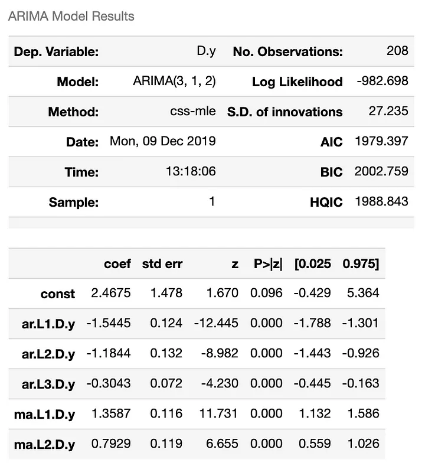

# ARIMA Models and Time Series Forecasting for Business Analytics

Autoregressive integrated moving average (ARIMA) models are a common method of time series forecasting. In this article, we look at examples of implementing ARIMA models in Python.

## Understanding ARIMA Models

One of the most widely used time series modeling techniques is the autoregressive integrated moving average (ARIMA) model. ARIMA models are a class of linear models that can capture a wide range of time series patterns, including trend, seasonality, and autocorrelation.

The ARIMA model is denoted as ARIMA(p,d,q), where:

- $p$ represents the order of the autoregressive (AR) component

- $d$ represents the degree of differencing needed to make the time series stationary

- $q$ represents the order of the moving average (MA) component

The autoregressive (AR) component models the dependence of the current value on the past values of the series. The moving average (MA) component models the dependence of the current value on the past error terms. The \"integrated\" (I) component refers to the differencing applied to the series to achieve stationarity.

## Moving Averages

One of the key components of the ARIMA model is the moving average (MA) term. The moving average model assumes that the current value of the time series is a linear function of the current and past error terms.

The moving average model can be useful for capturing short-term dependencies and smoothing out the time series. It is particularly effective when the series exhibits significant white noise or random fluctuations.

## Implementing ARIMA in Python

In Python, the `statsmodels` library provides the tools needed for ARIMA and time series analysis:

from statsmodels.tsa.arima.model import ARIMA

    # Load the time series data
data = pd.read_csv('sales_data.csv', index_col='date')

    # Fit the ARIMA(1,1,1) model
model = ARIMA(data, order=(1,1,1)) model_fit = model.fit()

    # Make forecasts
forecast = model_fit.forecast(steps=10)[0]

In this example, we first load the time series data into a `pandas` DataFrame. We then create an ARIMA model instance, specifying the order of the AR, I, and MA components as (1,1,1). The `fit()` method is used to estimate the model parameters based on the historical data.

Finally, we can use the `forecast()` method to generate predictions for the next 10 time periods. The function returns the forecast values, as well as the standard errors and confidence intervals for the forecasts.

## ARIMA Models and Different Types of Time Series Data

ARIMA models are versatile and can be applied to a wide range of time series data, including those with various characteristics:

1.  **Trends:** The \"integrated\" (I) component of the ARIMA model allows it to handle non-stationary time series with trends. By differencing the data, the model can remove the trend and make the series stationary, which is a key assumption for many time series techniques.

2.  **Seasonality:** ARIMA models can be extended to handle seasonal patterns through the use of seasonal ARIMA (SARIMA) models. These models include additional seasonal AR and MA terms to capture periodic fluctuations in the data.

3.  **Heteroscedasticity:** ARIMA models assume constant variance (homoscedasticity) in the error terms. However, this assumption can be relaxed by using ARIMA models in conjunction with GARCH (Generalized Autoregressive Conditional Heteroscedasticity) models, which can handle time-varying volatility in the data.

4.  **Outliers and Structural Breaks:** ARIMA models can be robust to the presence of outliers or structural breaks in the data, provided that the model is correctly specified. Techniques like intervention analysis or the inclusion of dummy variables can help the ARIMA model adapt to these types of disruptions.

5.  **Multivariate Data:** While the basic ARIMA model is univariate, it can be extended to handle multivariate time series data through the use of vector autoregressive (VAR) models. These models capture the interdependencies between multiple time series.

The flexibility of ARIMA models, along with their strong theoretical foundation and robust statistical properties, make them a go-to choice for many time series forecasting and analysis tasks. By carefully specifying the model parameters and addressing any data-specific challenges, ARIMA models can be effectively applied to a diverse range of time series data.

## Key Takeaways

- $p$ represents the order of the autoregressive (AR) component
- $d$ represents the degree of differencing needed to make the time series stationary
- $q$ represents the order of the moving average (MA) component
